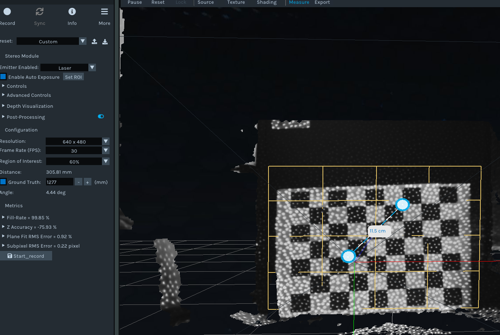
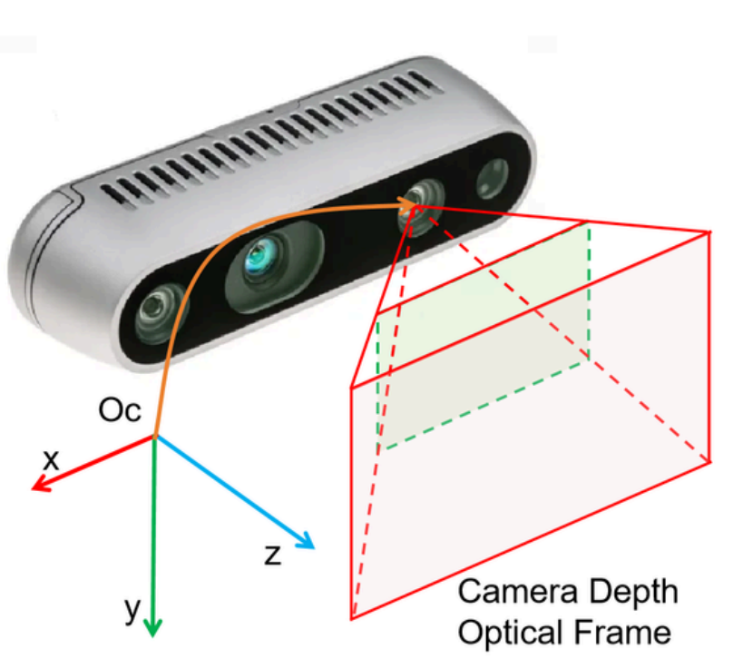

# 🎯 Camera Coordinate System & Measurement Verification Using RealSense Depth Camera
---
## 🧠 Overview
This document explains how the **Intel RealSense Depth Camera** defines its **3D coordinate system**, how the **origin** is placed, and how image coordinates (pixels) relate to real-world 3D coordinates (X, Y, Z).

---

## 🧭 Coordinate System in Intel RealSense
- Intrinsic and extrinsic camera parameters  
- Field of view (FOV) and focal length  
- Depth alignment and registration  
- Projection from image (u,v) to world (X,Y,Z) coordinates  
- Transformations between **camera**, **depth**, and **world** coordinate frames

---

## 🧠 Use in This Project
This coordinate system was used to:
- Align OpenPose 2D keypoints with depth data.  
- Convert 2D skeletons to accurate 3D joint positions.  
- Visualize the human body skeleton in real-world space.

---

---

---
## 📎 Reference
- [Intel RealSense SDK Documentation](https://dev.intelrealsense.com/docs)  
- [OpenPose Body Keypoints Documentation](https://github.com/CMU-Perceptual-Computing-Lab/openpose)

